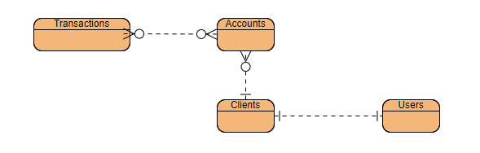

# Bank App - Demo

## Description:

Bank App Demo is an application designed to provide a comprehensive experience for managing bank accounts efficiently and securely. The application is targeted towards both individual clients and businesses who wish to access and administer their bank accounts from anywhere, at any time.

## Key Features:

### AccountDepositor:
Users can make deposits from their linked bank accounts or between accounts transfers.

### AccountDetailsFinder:
Users can easily access specific details of their bank accounts, such as current balance, transaction history, and account details.
This feature provides a detailed and up-to-date view of users' financial information for more effective financial management.

### ClientAuthenticator:
Security is a fundamental priority in the Virtual Banking, and this feature ensures secure authentication of users before accessing their bank accounts.

### ClientFinder:
This feature allows users to quickly find relevant information about other bank clients.

## Views UI

| URLs                                        | Description     |
|---------------------------------------------|-----------------|
| localhost:8080/                             | User's View     |
| localhost:8080/admin                        | Employee's View |
| localhost:8080/api/*                        | Http APIs       |
| http://localhost:8080/swagger-ui/index.html | swagger's View  |

## Users

| User         | Password           |
|--------------|--------------------|
| alan.marquez | password1  |
| joe.doe      | password2 |

## RUN DEMO
### Create Image
docker build -t bank_app:0.0.1 .
### Run container
docker run -p 8080:8080 bank_app:0.0.1

## Architecture

### Deploy Components
The Angular-Spring Boot Page Server is a web application built on the Spring Boot framework that serves Angular pages in English. It combines the powerful backend capabilities of Spring Boot with the dynamic frontend experience provided by Angular.

#### Key Features:

Angular Integration:

The application seamlessly integrates with Angular to serve dynamic and interactive web pages.
Angular's robust frontend framework allows for the creation of modern, responsive user interfaces.

RESTful API Endpoints:

Spring Boot provides RESTful API endpoints to handle client requests and serve data to the Angular frontend.
These endpoints enable efficient communication between the frontend and backend, facilitating seamless data exchange.

### DataBase

